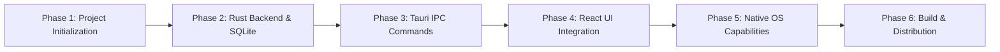

# Pure Tauri (Rust) Project Planning & Execution Roadmap

> **Project Target**: Pure Tauri 2.0 Desktop Application  
> **Backend**: Rust 2021 + SQLx (SQLite)  
> **Frontend**: React 19 + TypeScript + Tailwind CSS v4  
> **Target Platforms**: Windows 10/11 & macOS (Intel / Apple Silicon)  
> **Master Domain Specification**: See [SHUTTERBOX_DOMAIN_LOGIC.md](file:///f:/React%20+%20Laravel%20Projects/shutterbox-system/docs/SHUTTERBOX_DOMAIN_LOGIC.md) for full database schemas, formulas, and business rules.

---

## 1. Project Execution Phases

---

## 2. Granular Execution Checklist

### Phase 1: Environment & Toolchain Initialization
- [ ] Install Rust toolchain via `rustup` (`stable-x86_64-pc-windows-msvc` or `stable-aarch64-apple-darwin`).
- [ ] Initialize Tauri 2.0 app workspace with React + TypeScript template.
- [ ] Configure `src-tauri/Cargo.toml` with required crates: `tauri`, `serde`, `serde_json`, `sqlx` (with `sqlite`, `runtime-tokio`, `tls-native-tls`), `tokio`.
- [ ] Setup frontend dependencies: React 19, TypeScript, Tailwind CSS v4, Radix UI, `@tauri-apps/api`.
- [ ] Configure strict TypeScript type-checking in `tsconfig.json`.

### Phase 2: SQLite Integration & Database Migrations in Rust
- [ ] Implement database path resolution logic in Rust to locate OS-specific `app_data_dir`.
- [ ] Set up `sqlx::SqlitePool` connection pool in Rust.
- [ ] Create embedded SQL migration scripts in `src-tauri/migrations/`.
- [ ] Configure automatic database creation (`SqliteConnectOptions::new().create_if_missing(true)`).
- [ ] Execute `sqlx::migrate!("./migrations").run(&pool)` during Tauri setup in `lib.rs`.
- [ ] Inject connection pool into Tauri state using `app.manage(pool)`.

### Phase 3: Tauri Async IPC Command Development
- [ ] Define Rust domain models (`struct`s with `#[derive(Serialize, Deserialize, sqlx::FromRow)]`).
- [ ] Implement async CRUD commands annotated with `#[tauri::command]`:
  - [ ] `get_items(state: State<'_, SqlitePool>) -> Result<Vec<Item>, String>`
  - [ ] `create_item(state: State<'_, SqlitePool>, payload: CreateItemDto) -> Result<Item, String>`
  - [ ] `update_item(state: State<'_, SqlitePool>, payload: UpdateItemDto) -> Result<Item, String>`
  - [ ] `delete_item(state: State<'_, SqlitePool>, id: i64) -> Result<(), String>`
- [ ] Register all command handlers in `tauri::Builder::default().invoke_handler(...)`.

### Phase 4: React 19 + TypeScript IPC Client Integration
- [ ] Create strongly-typed TypeScript interfaces matching Rust structs in `src/types/api.ts`.
- [ ] Build a typed IPC wrapper module using `@tauri-apps/api/core` `invoke`.
- [ ] Implement custom React hooks (`useItems()`, `useCreateItem()`) or React Query hooks for state management.
- [ ] Build responsive UI layouts with Tailwind CSS v4 and Radix UI.

### Phase 5: Native Desktop Enhancements
- [ ] Configure application window properties (min size, resizable, title bar) in `tauri.conf.json`.
- [ ] Implement native system tray menu and tray icon.
- [ ] Add native file open/save dialogs using `@tauri-apps/plugin-dialog`.
- [ ] Implement OS desktop notifications using `@tauri-apps/plugin-notification`.

### Phase 6: Cross-Platform Build, Code Signing & Release
- [ ] Configure production bundler settings in `tauri.conf.json`.
- [ ] Windows: Configure NSIS / MSI installers and Authenticode code signing with SignTool.
- [ ] macOS: Configure universal bundle targets (`aarch64` and `x86_64`), Apple Developer ID code signing, and notarization.
- [ ] Compile production release installers using `npm run tauri build`.

---

## 3. Dependency Matrix

| Layer | Library / Crate | Version | Purpose |
| :--- | :--- | :--- | :--- |
| **Rust Backend** | `tauri` | `^2.0` | Native app framework & window host |
| **Rust Backend** | `sqlx` | `^0.8` | Async SQLite database driver & ORM |
| **Rust Backend** | `tokio` | `^1.40` | Async runtime |
| **Rust Backend** | `serde` / `serde_json` | `^1.0` | High-speed IPC JSON serialization |
| **Frontend UI** | `react` / `react-dom` | `^19.0` | UI rendering engine |
| **Frontend UI** | `@tauri-apps/api` | `^2.0` | Client-side IPC bridge to Rust commands |
| **Frontend UI** | `typescript` | `^5.7` | Type safety across IPC boundaries |
| **Styling** | `tailwindcss` | `^4.0` | Utility-first CSS styling |
