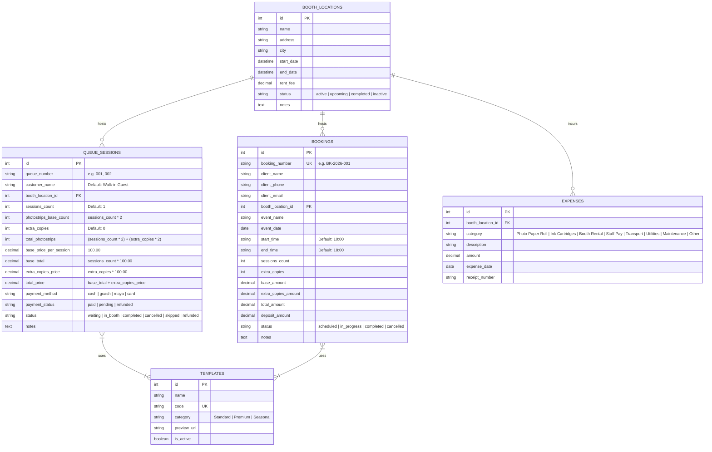

# Shutterbox System — Complete Domain Logic & Feature Specification

> **Specification Purpose**: Master reference document containing all data schemas, business logic rules, pricing formulas, queue state machines, and financial calculations extracted directly from the Shutterbox System.  
> **Use Case**: Execute directly when building the fresh pure Tauri + Rust + SQLite + React project.

---

## 1. Database Schemas & Entity Specifications



---

## 2. Domain Business Rules & Algorithms

### A. Queue Number Generation Algorithm
1. Query active queue sessions with status in `['waiting', 'in_booth', 'skipped']`.
2. Extract numeric integers from existing queue numbers (e.g. `"007"` $\rightarrow$ `7`).
3. Find the lowest missing integer starting from `1`.
4. Format integer as a zero-padded 3-digit string (e.g. `1` $\rightarrow$ `"001"`, `12` $\rightarrow$ `"012"`).

### B. Pricing & Photostrip Calculations
For any Photobooth Queue Session:
- **Base Price per Session**: `₱100.00`
- **Extra Copy Unit Price**: `₱100.00` (provides 2 extra photostrips)
- **Photostrips Base Count**: `sessions_count * 2`
- **Extra Photostrips Count**: `extra_copies * 2`
- **Total Photostrips**: `photostrips_base_count + extra_photostrips_count`
- **Base Total Price**: `sessions_count * 100.00`
- **Extra Copies Price**: `extra_copies * 100.00`
- **Total Price**: `base_total + extra_copies_price`

### C. Queue Priority Sorting Rule
When displaying the live queue dashboard, sessions must be sorted using custom status priority:
1. `in_booth` (Priority 1 — Currently inside photobooth)
2. `waiting` (Priority 2 — Next in line)
3. `skipped` (Priority 3 — Temporarily skipped)
4. `completed` (Priority 4 — Finished session)
5. `refunded` (Priority 5 — Refunded ticket)
6. `cancelled` (Priority 6 — Cancelled ticket)
*Secondary Sort*: Ascending by `id` or creation time.

### D. Queue Status Transition State Machine
- `waiting` $\rightarrow$ `in_booth` (Customer enters photobooth)
- `in_booth` $\rightarrow$ `completed` (Session done, photos printed)
- `waiting` / `in_booth` $\rightarrow$ `skipped` (Customer absent when called)
- `skipped` $\rightarrow$ `waiting` or `in_booth` (Re-queue when customer returns)
- Any status $\rightarrow$ `cancelled` / `refunded`:
  - Automatically updates `payment_status` to `'refunded'`.

### E. Financial Reporting & Analytics Formulas
- **Daily Gross Sales**:
  $$\text{Daily Gross} = \sum \text{Queue Session Total Price (\text{payment\_status} = \text{'paid'} \text{ today})} + \sum \text{Booking Total Amount (\text{status} \neq \text{'cancelled'} \text{ today})}$$
- **Monthly Gross Sales**:
  $$\text{Monthly Gross} = \sum \text{Paid Queue Sales this Month} + \sum \text{Non-cancelled Booking Sales this Month}$$
- **Monthly Net Income**:
  $$\text{Net Income} = \text{Monthly Gross Sales} - \sum \text{Expenses Amount this Month}$$
- **Payment Breakdown Aggregation**: Sum `total_price` grouped by `payment_method` (`cash`, `gcash`, `maya`, `card`).

---

## 3. SQLx Database Migration Script (Rust Code)

```sql
-- Up Migration for SQLite in Pure Tauri Rust Backend
CREATE TABLE IF NOT EXISTS templates (
    id INTEGER PRIMARY KEY AUTOINCREMENT,
    name TEXT NOT NULL,
    code TEXT NOT NULL UNIQUE,
    category TEXT NOT NULL DEFAULT 'Standard',
    preview_url TEXT,
    is_active BOOLEAN NOT NULL DEFAULT 1,
    created_at DATETIME DEFAULT CURRENT_TIMESTAMP,
    updated_at DATETIME DEFAULT CURRENT_TIMESTAMP
);

CREATE TABLE IF NOT EXISTS booth_locations (
    id INTEGER PRIMARY KEY AUTOINCREMENT,
    name TEXT NOT NULL,
    address TEXT,
    city TEXT,
    start_date DATETIME NOT NULL,
    end_date DATETIME NOT NULL,
    rent_fee REAL NOT NULL DEFAULT 0.00,
    status TEXT NOT NULL DEFAULT 'active',
    notes TEXT,
    created_at DATETIME DEFAULT CURRENT_TIMESTAMP,
    updated_at DATETIME DEFAULT CURRENT_TIMESTAMP
);

CREATE TABLE IF NOT EXISTS bookings (
    id INTEGER PRIMARY KEY AUTOINCREMENT,
    booking_number TEXT NOT NULL UNIQUE,
    client_name TEXT NOT NULL,
    client_phone TEXT NOT NULL,
    client_email TEXT,
    booth_location_id INTEGER REFERENCES booth_locations(id) ON DELETE SET NULL,
    event_name TEXT NOT NULL,
    event_date DATE NOT NULL,
    start_time TEXT NOT NULL DEFAULT '10:00',
    end_time TEXT NOT NULL DEFAULT '18:00',
    sessions_count INTEGER NOT NULL DEFAULT 1,
    extra_copies INTEGER NOT NULL DEFAULT 0,
    base_amount REAL NOT NULL DEFAULT 0.00,
    extra_copies_amount REAL NOT NULL DEFAULT 0.00,
    total_amount REAL NOT NULL DEFAULT 0.00,
    deposit_amount REAL NOT NULL DEFAULT 0.00,
    status TEXT NOT NULL DEFAULT 'scheduled',
    notes TEXT,
    created_at DATETIME DEFAULT CURRENT_TIMESTAMP,
    updated_at DATETIME DEFAULT CURRENT_TIMESTAMP
);

CREATE TABLE IF NOT EXISTS queue_sessions (
    id INTEGER PRIMARY KEY AUTOINCREMENT,
    queue_number TEXT NOT NULL,
    customer_name TEXT NOT NULL DEFAULT 'Walk-in Guest',
    booth_location_id INTEGER REFERENCES booth_locations(id) ON DELETE SET NULL,
    sessions_count INTEGER NOT NULL DEFAULT 1,
    photostrips_base_count INTEGER NOT NULL DEFAULT 2,
    extra_copies INTEGER NOT NULL DEFAULT 0,
    total_photostrips INTEGER NOT NULL DEFAULT 2,
    base_price_per_session REAL NOT NULL DEFAULT 100.00,
    base_total REAL NOT NULL DEFAULT 100.00,
    extra_copies_price REAL NOT NULL DEFAULT 0.00,
    total_price REAL NOT NULL DEFAULT 100.00,
    payment_method TEXT NOT NULL DEFAULT 'cash',
    payment_status TEXT NOT NULL DEFAULT 'paid',
    status TEXT NOT NULL DEFAULT 'waiting',
    notes TEXT,
    created_at DATETIME DEFAULT CURRENT_TIMESTAMP,
    updated_at DATETIME DEFAULT CURRENT_TIMESTAMP
);

CREATE TABLE IF NOT EXISTS expenses (
    id INTEGER PRIMARY KEY AUTOINCREMENT,
    booth_location_id INTEGER REFERENCES booth_locations(id) ON DELETE SET NULL,
    category TEXT NOT NULL,
    description TEXT NOT NULL,
    amount REAL NOT NULL,
    expense_date DATE NOT NULL,
    receipt_number TEXT,
    created_at DATETIME DEFAULT CURRENT_TIMESTAMP,
    updated_at DATETIME DEFAULT CURRENT_TIMESTAMP
);

CREATE TABLE IF NOT EXISTS queue_session_template (
    id INTEGER PRIMARY KEY AUTOINCREMENT,
    queue_session_id INTEGER NOT NULL REFERENCES queue_sessions(id) ON DELETE CASCADE,
    template_id INTEGER NOT NULL REFERENCES templates(id) ON DELETE CASCADE
);

CREATE TABLE IF NOT EXISTS booking_template (
    id INTEGER PRIMARY KEY AUTOINCREMENT,
    booking_id INTEGER NOT NULL REFERENCES bookings(id) ON DELETE CASCADE,
    template_id INTEGER NOT NULL REFERENCES templates(id) ON DELETE CASCADE
);

-- Performance Indexes
CREATE INDEX IF NOT EXISTS idx_queue_sessions_status ON queue_sessions(status);
CREATE INDEX IF NOT EXISTS idx_queue_sessions_created ON queue_sessions(created_at);
CREATE INDEX IF NOT EXISTS idx_bookings_date ON bookings(event_date);
CREATE INDEX IF NOT EXISTS idx_expenses_date ON expenses(expense_date);
```

---

## 4. Rust Data Structures (`src-tauri/src/models.rs`)

```rust
use serde::{Deserialize, Serialize};

#[derive(Debug, Serialize, Deserialize, sqlx::FromRow)]
pub struct QueueSession {
    pub id: i64,
    pub queue_number: String,
    pub customer_name: String,
    pub booth_location_id: Option<i64>,
    pub sessions_count: i64,
    pub photostrips_base_count: i64,
    pub extra_copies: i64,
    pub total_photostrips: i64,
    pub base_price_per_session: f64,
    pub base_total: f64,
    pub extra_copies_price: f64,
    pub total_price: f64,
    pub payment_method: String,
    pub payment_status: String,
    pub status: String,
    pub notes: Option<String>,
    pub created_at: String,
}

#[derive(Debug, Deserialize)]
pub struct CreateQueueSessionPayload {
    pub customer_name: Option<String>,
    pub booth_location_id: Option<i64>,
    pub sessions_count: i64,
    pub extra_copies: i64,
    pub payment_method: String,
    pub payment_status: String,
    pub template_ids: Vec<i64>,
    pub notes: Option<String>,
}

#[derive(Debug, Serialize, Deserialize, sqlx::FromRow)]
pub struct BoothLocation {
    pub id: i64,
    pub name: String,
    pub address: Option<String>,
    pub city: Option<String>,
    pub start_date: String,
    pub end_date: String,
    pub rent_fee: f64,
    pub status: String,
    pub notes: Option<String>,
}

#[derive(Debug, Serialize, Deserialize, sqlx::FromRow)]
pub struct Expense {
    pub id: i64,
    pub booth_location_id: Option<i64>,
    pub category: String,
    pub description: String,
    pub amount: f64,
    pub expense_date: String,
    pub receipt_number: Option<String>,
}
```

---

## 5. UI Views & Module Map

| Module | Route / Component | Primary Responsibilities |
| :--- | :--- | :--- |
| **Dashboard** | `resources/js/Pages/dashboard.tsx` | Overview metrics (Today's Sales, Active Queue, Top Template, Upcoming Bookings). |
| **Queue Manager** | `resources/js/Pages/queuing/index.tsx` | Live queue board, status actions (`waiting` $\rightarrow$ `in_booth` $\rightarrow$ `completed`), ticket creation form. |
| **Queue Display (Kiosk)** | `resources/js/Pages/queuing/display.tsx` | Fullscreen public kiosk view showing ticket in booth and upcoming queue. |
| **Printable Receipt** | `resources/js/Pages/queuing/partials/receipt-modal.tsx` | Thermal printer formatted receipt modal with QR code & items. |
| **Event Locations** | `resources/js/Pages/events/index.tsx` | Management of pop-up booth locations, rent fees, and active dates. |
| **Bookings & Calendar** | `resources/js/Pages/calendar/index.tsx` | Scheduled photo booth event bookings calendar. |
| **Financials & Expenses**| `resources/js/Pages/financials/index.tsx` | Income vs Expense report, category filtering, net income calculations. |
| **Templates Library** | `resources/js/Pages/templates/index.tsx` | Photostrip frame template gallery and active status toggles. |
